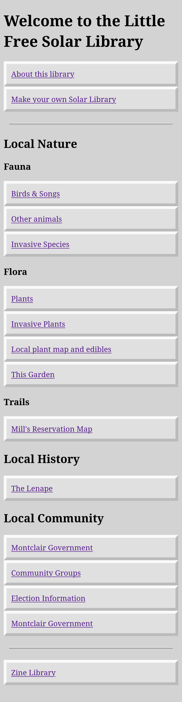

# Little Free Solar Library


```
+------------------------------------------------+
|   🌞 LITTLE FREE SOLAR LIBRARY                 |
|                                                |
|   📚   Ebooks & Zines                          |
|   🐦   Local Animal Sounds                     |
|   🏞️   Plants & Invasive Species Info          |
|   🗳️   Local Politics & Community Resources    |
|                                                |
|   📡 Connect to Wi-Fi: little-free-solar       |
|   🌐 Open browser: http://library.local        |
|                                                |
|   💡 Powered by the sun. Always free.          |
+------------------------------------------------+
```


## Status

Creates a wireless access point on a RaspberryPi Pico and serves html files.

## Roadmap

- Serve media files
- Adafruit Metro ESP32-S3 w/ MicroSD
- Battery power
- Solar power
- Enclosure designs
- DIY guide
- [Library content](library_content.md)

## Home Page Sketch


