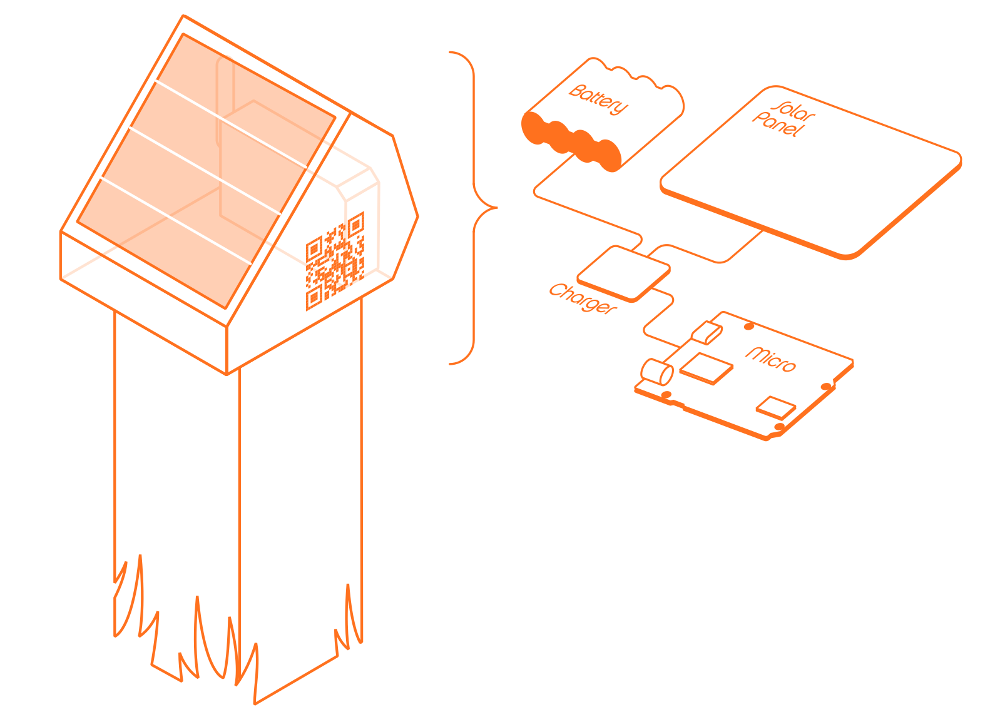
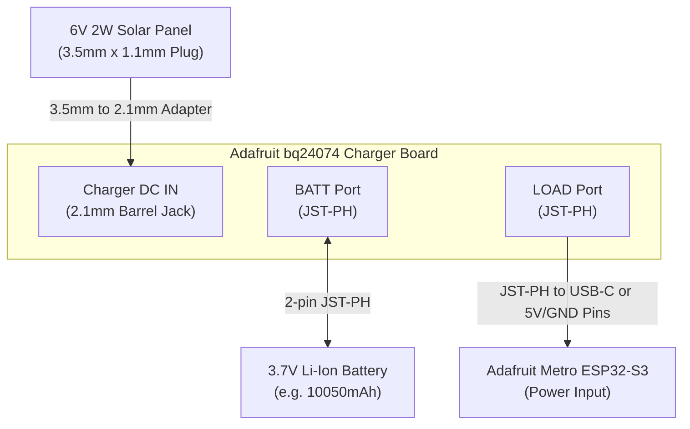

# Little Free Solar Library

[](working/library_page.png)

```
+------------------------------+
| 🌞 LITTLE FREE SOLAR LIBRARY |
|                              |
| 📚   Ebooks & Zines          |
|                              |
| 🐦   Local Animal Sounds     |
|                              |
| 🏞️   Plants &                |
|      Invasive Species Info   |      
|                              |
| 🗳️   Local Politics &        |
|      Community Resources     |
|                              |
| 📡   Connect to Wi-Fi:       |
|      little-free-solar       |
|                              |
| 🌐   Open browser:           |
|      http://library.local    |
|                              |
| 💡 Powered by the sun.       |
+------------------------------+

```
&nbsp;   



The *Little Free Solar Library* is a small, solar-powered device that creates a local, offline digital library. It broadcasts a Wi-Fi signal, allowing people nearby to connect and access  local flora &amp; fauna information, field recordings, environmental data, and civic information, local resources, zines, and instructions on how to build your solar library. No internet required. It’s designed to be simple, easy to make, and powered by the sun.

With open-source plans, this library can be built with just a few parts, and it runs entirely off-grid. It’s a chance for people to learn how to build their own solar-powered device, share knowledge, and connect with others in the community.

[github page](https://github.com/sparklelabs/little-free-solar-library)

### Status

Creates a wireless access point on a RaspberryPi Pico and serves html files.

### Roadmap

- Serve media files
- Adafruit Metro ESP32-S3 w/ MicroSD
- Battery power
- Solar power
- Enclosure designs
- DIY guide
- [Library content](library_content.md)

---

## Circuit Diagram & Description

The off-grid power system is governed by the **Adafruit bq24074 Charger Board**, which implements dynamic power path management (it routes power to the Metro first, and uses any leftover current to charge the battery).

### Connections
1. **Solar Input**: The 6V 2W Solar Panel (3.5mm x 1.1mm plug) connects via the **3.5mm-to-2.1mm DC Jack Adapter** into the charger board's **2.1mm DC Barrel Jack** input.
2. **Battery**: The 3.7V Lithium-Ion Battery connects to the charger's **BATT** JST-PH port.
3. **Load (Microcontroller)**: The charger's **LOAD** JST-PH port connects to the **Adafruit Metro ESP32-S3** power pins (or USB-C port). The LOAD port provides a regulated 4.4V output, which safely feeds the Metro's onboard 3.3V regulator.


```mermaid
graph TD
    SolarPanel["6V 2W Solar Panel<br>(3.5mm x 1.1mm Plug)"] -->|3.5mm to 2.1mm Adapter| DCIN["Charger DC IN<br>(2.1mm Barrel Jack)"]
    
    subgraph Charger ["Adafruit bq24074 Charger Board"]
        DCIN
        BATT_PORT["BATT Port<br>(JST-PH)"]
        LOAD_PORT["LOAD Port<br>(JST-PH)"]
    end
    
    BATT_PORT <-->|2-pin JST-PH| Battery["3.7V Li-Ion Battery<br>(e.g. 10050mAh)"]
    LOAD_PORT -->|JST-PH to USB-C or 5V/GND Pins| Metro["Adafruit Metro ESP32-S3<br>(Power Input)"]
```

### Parts

- [Adafruit Metro ESP32-S3 (space for files)](https://www.adafruit.com/product/5500) OR [Raspberry Pi Pico W (little space but cheap)](https://www.adafruit.com/product/6315)
- [Adafruit Universal USB / DC / Solar Lithium Ion/Polymer charger [bq24074]](https://www.adafruit.com/product/4755)
- [6V 2W Solar Panel - ETFE [Voltaic P126]](https://www.adafruit.com/product/5366)
- [3.8 / 1.3mm or 3.5 / 1.1mm to 5.5 / 2.1mm DC Jack Adapter Cable](https://www.adafruit.com/product/2788)
- [Lithium Ion Battery - 3.7V 10050mAh (10 Ah)](https://www.adafruit.com/product/5035)

[](working/library_page.png)
